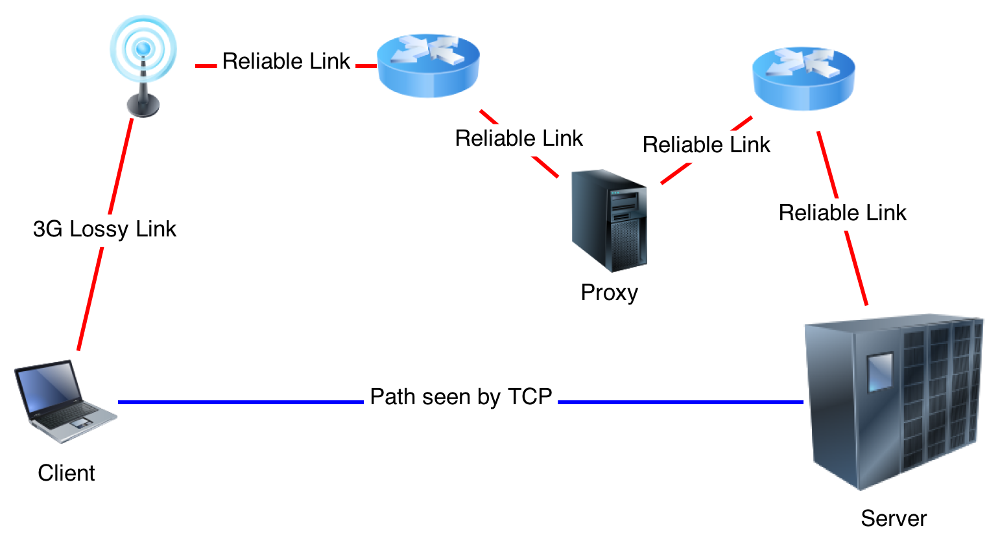

TCPeP
=====
  TCPeP is a Performance-Enhancing proxy for TCP over lossy links, using Network Coding principles. It is partly based on the paper "Network coded tcp - CTCP".  
  Standard TCP algorithm were designed with wired networks in mind, assuming that all losses resulted from congestion events.  
Coded-TCP is based on the assumption that losses can be completely random, as it occurs in some wireless links.

When to use it ?
=============
  This system is supposed to improve throughput and latency of a communication, compared to standard TCP. The problem it addresses is the problem of random losses, hence you **should** be able to see an improvement if you experience this over your link.  
However, most modern wireless networks effectively hides random packet losses to the upper layers, so there might not be any random loss over your particular network.  
  
I'm highly interested in any test cases or success story, as I did not have access to a wide range of networks to test the system for now.

How does it work ?
==================
The CTCP protocol works on two different levels :

* The congestion control is based on RTT measurements, à la TCP-Vegas
* The loss correction is based on Network Coding (see the [included](./Network_Coding.pdf "included") file for more details)

How can I use it ?
==================
The system consists of a client software on the mobile host and a proxy side, on a ground server. The architecture is represented in the diagram below:

Requirements
------------

1.  Both hosts must run Linux (it also might work on other Unix system.)
2.  You must have root access to the client, for iptables
3.  The Proxy must be connected to the Internet through a reliable link
4.  You should be able to communicate via UDP between the Client and the Proxy

Installation and Usage
----------------------

1.  Get the code:  
        `git clone "https://github.com/GregoireDelannoy/TCPeP.git"`
2.  Compile:  
        `make all`
3.  Run the Proxy, on the proxy host. _The UDP port should be reachable from the client_:  
        `./tcpep -P -u <UDP PORT TO LISTEN ON> (-v)`
4.  Run the Client:  
        `./tcpep -C <PROXY IP ADDRESS> -u <PROXY UDP PORT> -t <TCP PORT TO LISTEN ON> (-v)`
5. Redirect the connections you want to re-route through the proxy. For example:  

        # Redirect connections to HOST
        iptables -t nat -A OUTPUT -p tcp -d HOST -j REDIRECT --to-ports <CLIENT TCP PORT>
        
        # Redirect everything apart from localhost
        iptables -t nat -A OUTPUT -p tcp !-d 127.0.0.1 -j REDIRECT --to-ports <CLIENT TCP PORT>
        

Context and further information
===============================
This project started in 2012/2013 as an undergrad Final Year Project. I will try my best to debug and maintain it, but there's absolutely no guarantee as to the functionality !  
For more information, you could read my final project report [here](./Final_Report.pdf "here").
